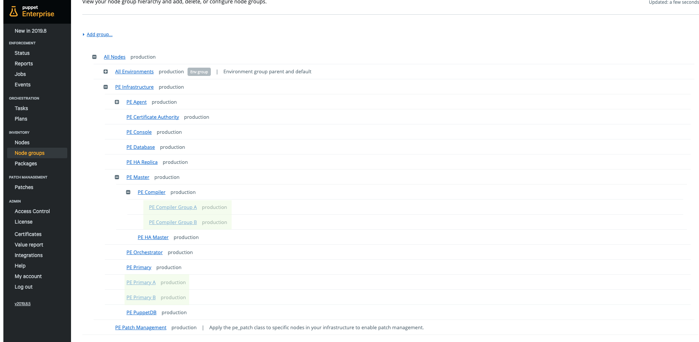
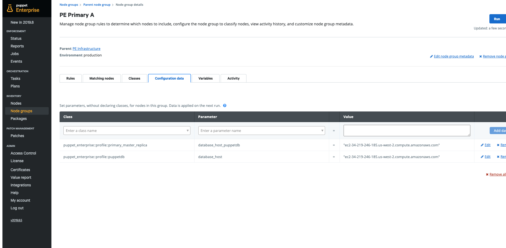
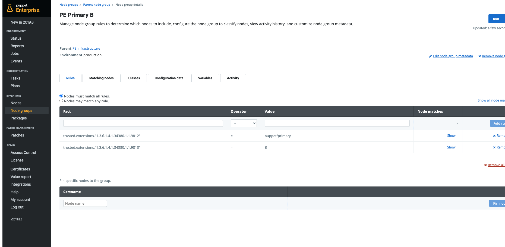
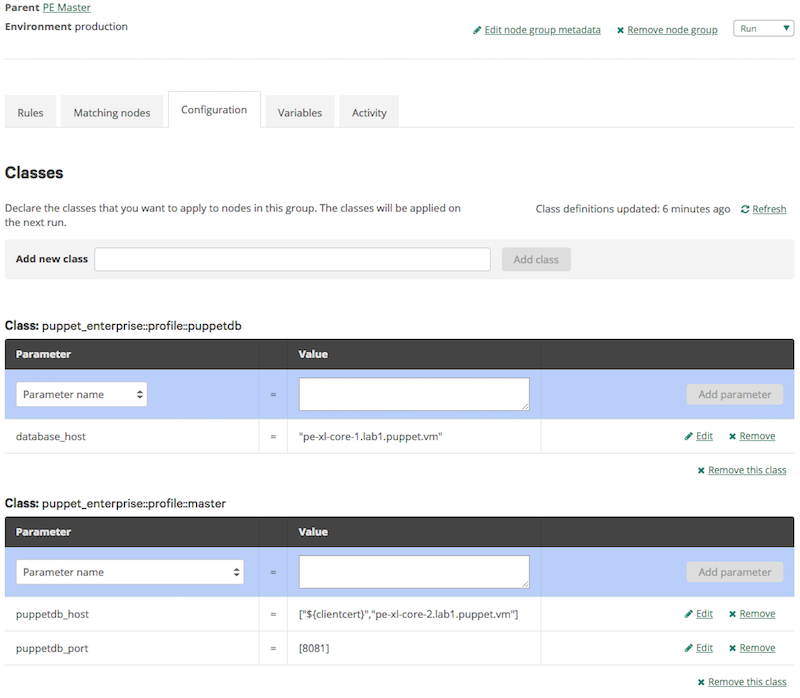

# PE Extra Large architecture classification #

## Overview

This reference implementation uses four non-default node classification groups to implement the Extra Large DR architecture. Intentionally, classification of default, out-of-box node groups is not modified. This allows normal commands such as `puppet infrastructure enable replica` to behave more or less exactly as they would in Standard or Large architecture clusters.

This image shows a fully expanded view of the PE Infrastructure node group, highlighting the new additions made to support the Extra Large architecture.

## Node Groups

The new groups are:

* PE Primary A
* PE Primary B
* PE Compiler Group A
* PE Compiler Group B

The configuration applied in each group looks as follows:

### PE Primary A

Notes for PE Primary A:

* The (initial) Primary is the only member of this node group
* Sets as data two parameters
    * `puppet_enterprise::profile::master_replica::database_host_puppetdb`
    * `puppet_enterprise::profile::puppetdb::database_host`
* Sets both parameters to the name of the PuppetDB PostgreSQL node paired with this primary
* Uses a different PuppetDB PostgreSQL node than PE Primary B

### PE Primary B

Notes for PE Primary B:

* The (initial) Primary Replica is the only member of this node group
* Sets as data two parameters
    * `puppet_enterprise::profile::master_replica::database_host_puppetdb`
    * `puppet_enterprise::profile::puppetdb::database_host`
* Sets both parameters to the name of the PuppetDB PostgreSQL node paired with this master
* Uses a different PuppetDB PostgreSQL node than PE Primary A

### PE Compiler Group A

Notes for PE Compiler Group A:

* Half of the compilers are members of this group
* Applies the `puppet_enterprise::profile::puppetdb` class
* Sets the `puppet_enterprise::profile::puppetdb::database_host` parameter
    * Should be set to `"pdb-pg-a"`, where "pdb-pg-a" is the name of the PuppetDB PostgreSQL database host paired with the (initial) Primary
* Modifies the `puppet_enterprise::profile::master::puppetdb_host` parameter
    * Should be set to `[${clientcert}, "primary-b"]`, where "primary-b" is the name of the (initial) Primary Replica.
    * If you have a load balancer for the compilers in PE Compiler Group B port 8081, you should use that load balancer address instead of "primary-b"
* Modifies the `puppet_enterprise::profile::master::puppetdb_port` parameter
    * Should be set to `[8081]`

### PE Compiler Group B

Notes for PE Compiler Group B:

* The other half of the compilers (those not in the PE Compiler Group A node group) are members of this group
* Applies the `puppet_enterprise::profile::puppetdb` class
* Sets the `puppet_enterprise::profile::puppetdb::database_host` parameter
    * Should be set to `"pdb-pg-b"`, where "pdb-pg-b" is the name of the PuppetDB PostgreSQL database host paired with the (initial) Primary Replica
* Modifies the `puppet_enterprise::profile::master::puppetdb_host` parameter
    * Should be set to `[${clientcert}, "primary-a"]`, where "primary-a" is the name of the PuppetDB PostgreSQL node paired with the (initial) Primary Replica.
    * If you have a load balancer for the compilers in PE Compiler Group A port 8081, you should use that load balancer address instead of "primary-a"
* Modifies the `puppet_enterprise::profile::master::puppetdb_port` parameter
    * Should be set to `[8081]`
