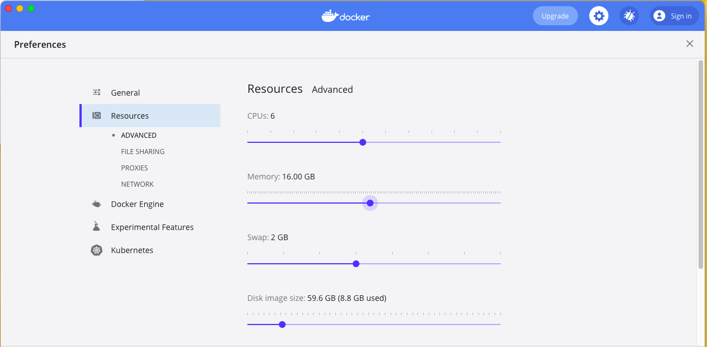

## Docker Based Examples
This module provides docker compose files for the various architectures for experimentation purposes. This gives you the ability to stand up an entire PE stack in order to learn how this module and DR works. If you have docker and docker-compose you can start up a full Puppet architecture with a single command.  Please note that Puppet does not support PE on containers in production.  

### Requirements
To run the container based examples you will need the following requirements:

1. Docker
2. Docker compose
3. Bolt 3.18+
3. realpath (brew install coreutils on mac)
4. 16GB memory, 24GB+ for XL and XL-DR architectures
5. CPU with many cores (Tested with Core i7 6700)
6. If using docker desktop ensure resources are set (the default of 2GB ram and 1GB swap on mac are inadequate)
    - As a reference, we tested with the below settings:
       - Resources -> Advanced
          - CPUs: 6
          - Memory: 16 GB
          - Swap: 2 GB


### Starting the example
We have provided a install.sh script to help making these examples simple.
To use perform the following:

1. cd spec/docker
2. bash install.sh
3. select desired architecture when prompted (ie. extra-large-ha )
4. Wait 10-20 minutes for installing to complete

```
Please choose a PE architecture to build: 
1) extra-large/     3) large/           5) standard/
2) extra-large-ha/  4) large-ha/        6) standard-ha/
#?  
```

### Stopping the example
In order to stop and remove the containers you will need to perform the following.

1. cd spec/docker
2. `cd <chosen architecture>` 
3. docker-compose down

Alternative you can run something similar like: `docker-compose --project-directory=large down`

### Logging into the console
You can login to the PE Console after successful install.  However, first you will need to 
grab the mapped port number of the PE console.  The port numbers are mapped dynamically as to not
cause port conflicts on your system. To see how the ports are mapped you can view them via:

1. docker ps
    ```
    80c6f0b5525c        pe-base             "/sbin/init"        2 hours ago         Up 2 hours          0.0.0.0:32774->22/tcp, 0.0.0.0:32773->443/tcp, 0.0.0.0:32772->4433/tcp, 0.0.0.0:32771->8080/tcp, 0.0.0.0:32770->8081/tcp, 0.0.0.0:32769->8140/tcp, 0.0.0.0:32768->8443/tcp   pe-lg.puppet.vm
    ```
2. Note the mapped port for 443, which in this case is 32773
3. Visit https://localhost:32773 in your browser
4. Accept security risk (self signed cert)
5. Login: admin/puppetlabs

### Logging into any of the containers
Ssh is running in all the containers so you can use ssh if you grab the mapped ssh port number. `ssh root@localhost -p 32774`

Login: root/test

You can also bypass ssh and run docker exec or docker-compose exec

1. cd spec/docker/extra-large
2. docker-compose exec pe_xl_core /bin/bash

**Note:** pe_xl_core is the name of the service defined in the respective docker-compose file.

This will run an interactive bash shell in the running container.

### Upgrades
There is also a upgrade.sh script that is similar to the install.sh script.  This script will upgrade an already installed PE stack to the version specified in the update_params.json file.

## Attaching agent containers
Because we are using containers we can start up numerous container instances and attach them all to the same PE stack.  In a matter of minutes you can easily attach hunders of new nodes to the PE stack (if resources allow). This is very useful for testing out scenarios involving different puppet versions or operating systems and even features like the orchestrator. 

To attach a container to the PE stack you first must get the network name of the PE stack.  This can be done with a command like: `docker inspect pe-xl-core-0.puppet.vm`.  You need to use either the container id or the container name of the MoM when inspecting. 

The network name we want to grab is 'extra-large-ha_default'.  (Yours will be different, but the output will be similar)

```shell
docker inspect pe-xl-core-0.puppet.vm -f "{{json .NetworkSettings.Networks }}" | jq
{
  "extra-large-ha_default": {
    "IPAMConfig": null,
    "Links": null,
    "Aliases": [
      "pe_xl_core_0",
      "5cf7047a36cd"
    ],
    "NetworkID": "204ae562a25510b2425f9fe3f1599c487e40dbcaaaaf02c2f73f6fa81f45d674",
    "EndpointID": "d91d7060fcc623a9f16cea09eecf83e9ee4454252e1af34053ef090f9c01c9c3",
    "Gateway": "172.25.0.1",
    "IPAddress": "172.25.0.6",
    "IPPrefixLen": 16,
    "IPv6Gateway": "",
    "GlobalIPv6Address": "",
    "GlobalIPv6PrefixLen": 0,
    "MacAddress": "02:42:ac:19:00:06",
    "DriverOpts": null
  }
}
```

You can also run `docker inspect pe-xl-core-0.puppet.vm -f "{{json .HostConfig.NetworkMode }}" | sed -e 's/^"//' -e 's/"$//'`

**NOTE** In these example you may see the use of `jq`.  This is a [cli utility for parsing JSON](https://stedolan.github.io/jq/).  I recommend installing it.  As a alternative you can pipe output to `python -m json.tool`.

### Starting agent containers
Once you have the network name you only need to specify the network when starting a container.  Puppet [publishes container images](https://hub.docker.com/r/puppet/puppet-agent) for all version of the puppet agent.  So you can easily switch agent versions with a single command. Which container image you use is entirely up to you.  If it doesn't have puppet preinstalled you can use the special curl command from the PE console to install it. 

Example:
 `docker run -ti --network=extra-large-ha_default --entrypoint=/bin/bash puppet/puppet-agent:latest`
 `docker run -ti --network=extra-large-ha_default --entrypoint=/bin/bash puppet/puppet-agent:6.15.0`
 `docker run -ti --network=extra-large-ha_default --entrypoint=/bin/bash puppet/puppet-agent:6.3.0`
 `docker run -ti --network=extra-large-ha_default --entrypoint=/bin/bash ruby:latest`

For most tasks these images are great.  However, if you wish to use puppet orchestrator with the pcp transport. The one requirement is that all images used must be systemd aware, otherwise pxp will not start. If you do not plan on using pcp 
there is no need for containers with systemd.

You can use the the custom image `pe-base` built with the docker cluster named pe-base.  This is a centos:7 image that you can use to generate tens or hundreds of agents.  (Resources permitting).  You will also want to run the docker run command with additonal flags.

`docker run -d -t --hostname=pe-std-agent1.puppet.vm --network=pe-std_default --privileged --label=pe-std-agent,docker-example-agent" -v /sys/fs/cgroup:/sys/fs/cgroup:ro pe-base"`

Once you have created the container you will obviously want to install the puppet agent

`docker exec -ti $CONTAINER_ID sh -c "curl -k https://${PE_SERVER}:8140/packages/current/install.bash | bash && puppet agent -t"`

Accept the cert in the console and run the puppet agent again on the agent container.

Login interactively if you wish: `docker exec -ti $CONTAINER_ID /bin/bash`

Take a look at the spec/docker/Dockerfile for examples of how to setup systemd in a container.


### Cleaning up
Before you run docker-compose down inside the cluster type directory you will need to stop and remove
all the agent containers if created.

This can be done like so:

```bash
# base name is the name of the primary hostname without domain
PE_CLUSTER_TYPE=standard
BASE_NAME=pe-std
docker stop $(docker ps -q -f label="${BASE_NAME}-agent")
docker rm $(docker ps -a -q -f label="${BASE_NAME}-agent")
# The docker-compose down command cannot be run until the agents have been removed
cd spec/docker/${PE_CLUSTER_TYPE}
docker-compose down

```

### Other notes
1. The install plan is not fully idempotent.
2. Some tasks may fail when run due to resource constraints.
3. You can rerun the install.sh script on the same architecture without destroying the containers.  This can sometimes complete the install process successfully. 
4. Rerunning the install script may result in errors due to idempotency issues with tasks and plans.
5. Please remember you are starting the equilivent of 3-6 VMs on a single system.  
6. You can use top to view all the processes being run in the containers.
7. Docker will use the privilege mode option when running these examples (systemd support)
8. Systemd is running inside these containers!  The real systemd, not the fake one.

If you see errors regarding peadmin::puppet_runonce, just run the install or upgrade script again.  Might have to perform multiple times for resource constrained docker hosts.
